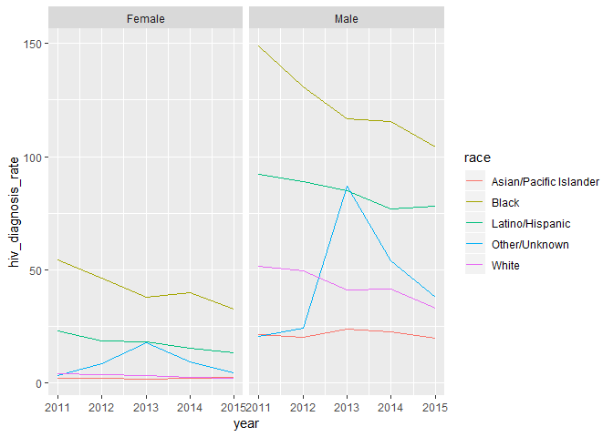

BJL2150\_Exploratory\_Data\_Analysis
================
Briana Lettsome
November 19, 2018

``` r
# Reading in of the DOHMH_HIV_AIDS_Annual_Report csv file.

hiv_data = read_csv(file = "./data/DOHMH_HIV_AIDS_Annual_Report.csv") %>%
  janitor::clean_names()
```

    ## Parsed with column specification:
    ## cols(
    ##   Year = col_integer(),
    ##   Borough = col_character(),
    ##   UHF = col_character(),
    ##   Gender = col_character(),
    ##   Age = col_character(),
    ##   Race = col_character(),
    ##   `HIV diagnoses` = col_integer(),
    ##   `HIV diagnosis rate` = col_double(),
    ##   `Concurrent diagnoses` = col_integer(),
    ##   `% linked to care within 3 months` = col_integer(),
    ##   `AIDS diagnoses` = col_integer(),
    ##   `AIDS diagnosis rate` = col_double(),
    ##   `PLWDHI prevalence` = col_double(),
    ##   `% viral suppression` = col_integer(),
    ##   Deaths = col_integer(),
    ##   `Death rate` = col_double(),
    ##   `HIV-related death rate` = col_double(),
    ##   `Non-HIV-related death rate` = col_double()
    ## )

``` r
hiv = hiv_data %>%
  filter(borough == "All") %>%
  select(year, race, hiv_diagnosis_rate, gender) %>%
  filter(!race == "All")

 # Spaghetti Plot showing the HIV Diagnosis Rates per race, faceted by gender.

hiv %>%
  ggplot(aes(x = year, y = hiv_diagnosis_rate, color = race, group = race)) +
  geom_line() +
  facet_grid(~gender)
```



Other/Unknown category includes people of Native American, multiracial, and unknown races.
==========================================================================================
