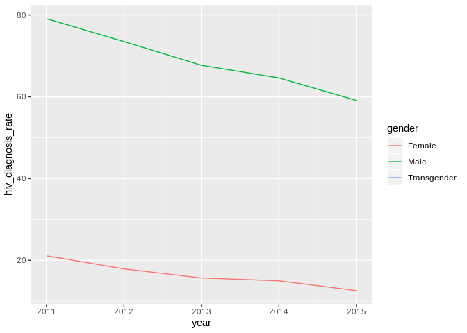
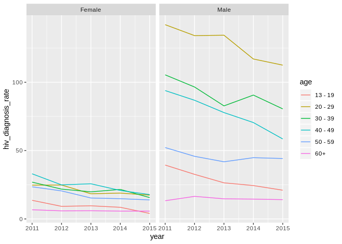

Untitled
================
Keunhyung Yu
November 14, 2018

``` r
hiv_data = 
  read_csv("data/DOHMH_HIV_AIDS_Annual_Report.csv") %>% 
  janitor::clean_names()
```

    ## Parsed with column specification:
    ## cols(
    ##   Year = col_integer(),
    ##   Borough = col_character(),
    ##   UHF = col_character(),
    ##   Gender = col_character(),
    ##   Age = col_character(),
    ##   Race = col_character(),
    ##   `HIV diagnoses` = col_integer(),
    ##   `HIV diagnosis rate` = col_double(),
    ##   `Concurrent diagnoses` = col_integer(),
    ##   `% linked to care within 3 months` = col_integer(),
    ##   `AIDS diagnoses` = col_integer(),
    ##   `AIDS diagnosis rate` = col_double(),
    ##   `PLWDHI prevalence` = col_double(),
    ##   `% viral suppression` = col_integer(),
    ##   Deaths = col_integer(),
    ##   `Death rate` = col_double(),
    ##   `HIV-related death rate` = col_double(),
    ##   `Non-HIV-related death rate` = col_double()
    ## )

``` r
hiv_boro =
  hiv_data %>%
  filter(borough != "All", uhf == "All", gender == "All" & age == "All" & race == "All")

hiv_uhf =
  hiv_data %>%
  filter(borough != "All", uhf != "All", gender == "All", age == "All", race == "All")

hiv_gend =
  hiv_data %>%
  filter(borough == "All", uhf == "All", gender != "All", age == "All", race == "All") %>% 
  mutate(hiv_diagnosis_rate = recode(hiv_diagnosis_rate, '99999.0' = NaN))

hiv_age =
  hiv_data %>%
  filter(age != "All", borough == "All", uhf == "All")

hiv_race =
  hiv_data %>%
  filter(race != "All", borough == "All", uhf == "All")
```

``` r
hiv_gend %>% 
  ggplot(aes(year, hiv_diagnosis_rate)) +
  geom_line(aes(group = gender, color = gender))
```

    ## Warning: Removed 5 rows containing missing values (geom_path).



``` r
hiv_age %>% 
  ggplot(aes(year, hiv_diagnosis_rate)) +
  geom_line(aes(group = age, color = age)) + 
  facet_wrap(~gender)
```


