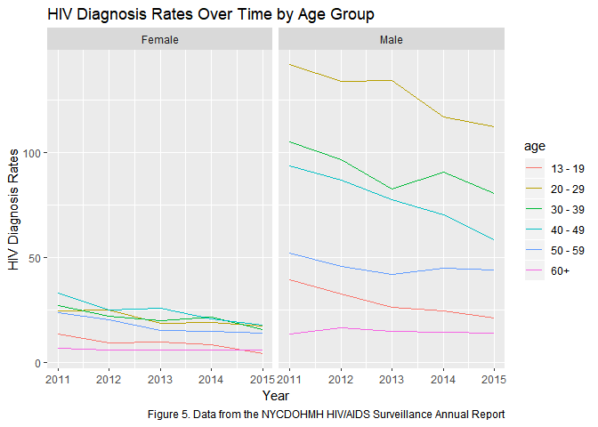

**Project Title**

Identification And Analysis of Trends And Disparities In HIV/AIDS For NYC

**Group Members**

* Bryce Wong (baw2160)
* Sunny Siddique (as5457)
* David Yu (ky2288)
* Noah Kreski (Ntk2109)
* Briana Lettsome (Bjl2150)


**Motivation / Related Work**

According to the the past decade or so, improvements in drug therapies and prevention intervations have led to a decreased number of AIDS cases. In June, 2014, New York Governor Andrew Cuomo announced a new strategy designed to "End the Epidemic" in the state through a combination of increased HIV screening and testing, promotion of Pre-exposure Prophylaxis (PrEP) and improved linkage and retention in clinical care for HIV-positive persons. Since then, the New York City Department of Health and Mental Hygiene (DOHMH) reported a decline in new infections of nearly 8 percent annually or approximately 15% since the campaign was launched.

Despite efforts to reduce the number of new infections, the HIV Surveillance Annual Report presented a number of key points that motivated our decision to analyze HIV infections data. Amongst them, the most noteworthy are:

* Poor New Yorkers, as well as African-American and Hispanic New Yorkers, bear a disproportionate burden of illness and premature death.
* Poor health is concentrated in certain New York City neighborhoods.
* Factors associated with poor health, such as poor access to medical care, unhealthy behaviors, and poor living conditions, are more common among certain economic and racial/ethnic groups.

**Initial Questions**

* Are there disparities in HIV infections / diagnoses based on NYC neighborhoods, if so, which neighborhoods have the highest incidence of HIV infections? Which neighborhoods have the lowest incidence?
* Are there disparities in common demographic factors, including age, gender and race? 
* Does HIV related death rate appear elevated for certain social groups? What about non-HIV related deaths?
* Are there specific observable trends in "percent viral suppression" over the past few years? If so, do the trends appear comparable to the DOHMH interventions following Governor Cuomo's announcements in 2014?


**Data**

  The data that was utilized for this project was the New York City Department of
Health and Mental Hygeine (NYCDHMH) HIV/AIDS Surveillance Annual Report. This
dataset contains HIV/AIDS-related data on individuals thirteen years or older 
in all NYC boroughs.The dataset was downloaded from NYCOpen Data, an open website
that provides information and data to New Yorkers by the NYC government. Once
downloaded, the raw data was imported into Rstudio as a CSV file.

  The data contained within the dataset were collected between the years 2011
through 2016. The HIV/AIDS Surveillance Annual Report contains eighteen variables,
including year, age, race, HIV diagnoses, deaths, percent viral suppression and
percent linked to care. The variable outcomes used within the visualizations 
are defined as followed:

* Non-HIV-related death rate = "Number of deaths attributed to other causes per
1,000 people mid-year living with HIV/AIDS" 

* HIV-related death rate = "Number of deaths attributed to HIV/AIDS per 1,000 people mid-year living with HIV/AIDS" 

* HIV diagnosis rate = "HIV diagnoses per 100,000 NYC population using annual
intercensal population estimates"

* Percent viral suppression = "Proportion of people living with diagnosed HIV
infection 13 years of age or older with at least one viral load test during the
calendar year whose last HIV viral load value was ≤200 copies/mL".

(NYCDOHMH HIV/AIDS Surveillance Annual Report)

                            

###**Exploratory analysis**


**Big Picture Visualizations**


```r
hiv_year_data = hiv_data %>% 
  filter(
    borough == "All",
    uhf == "All",
    gender == "All",
    age == "All",
    race == "All"
  )

stacked_death_plot = hiv_year_data %>% 
  filter(non_hiv_related_death_rate != 99999,
         hiv_related_death_rate != 99999) 

stacked_death_plot %>% plot_ly(x = ~year, y = ~non_hiv_related_death_rate, type = 'bar', name = 'Non HIV-related death rate') %>%
  add_trace(y = ~hiv_related_death_rate, name = 'HIV-related death rate') %>%
  layout(title = "Death Rate Types over the Years", 
         annotations = list(x = 1, y = -0.1, 
                            text = 'Figure 1',
                            font = list(size = 12),
                            showarrow = FALSE,
                            xref = 'paper', xanchor = 'right',
                            yref = 'paper', yanchor = 'auto',
                            xshift = 0, yshift = 0),
         yaxis = list(title = 'Rate'), 
         barmode = 'stack')
```

<!--html_preserve--><div id="htmlwidget-789c9521f300661848c2" style="width:672px;height:480px;" class="plotly html-widget"></div>
<script type="application/json" data-for="htmlwidget-789c9521f300661848c2">{"x":{"visdat":{"20483e2ddc2":["function () ","plotlyVisDat"]},"cur_data":"20483e2ddc2","attrs":{"20483e2ddc2":{"x":{},"y":{},"name":"Non HIV-related death rate","alpha_stroke":1,"sizes":[10,100],"spans":[1,20],"type":"bar"},"20483e2ddc2.1":{"x":{},"y":{},"name":"HIV-related death rate","alpha_stroke":1,"sizes":[10,100],"spans":[1,20],"type":"bar","inherit":true}},"layout":{"margin":{"b":40,"l":60,"t":25,"r":10},"title":"Death Rate Types over the Years","annotations":[{"x":1,"y":-0.1,"text":"Figure 1","font":{"size":12},"showarrow":false,"xref":"paper","xanchor":"right","yref":"paper","yanchor":"auto","xshift":0,"yshift":0}],"yaxis":{"domain":[0,1],"automargin":true,"title":"Rate"},"barmode":"stack","xaxis":{"domain":[0,1],"automargin":true,"title":"year"},"hovermode":"closest","showlegend":true},"source":"A","config":{"modeBarButtonsToAdd":[{"name":"Collaborate","icon":{"width":1000,"ascent":500,"descent":-50,"path":"M487 375c7-10 9-23 5-36l-79-259c-3-12-11-23-22-31-11-8-22-12-35-12l-263 0c-15 0-29 5-43 15-13 10-23 23-28 37-5 13-5 25-1 37 0 0 0 3 1 7 1 5 1 8 1 11 0 2 0 4-1 6 0 3-1 5-1 6 1 2 2 4 3 6 1 2 2 4 4 6 2 3 4 5 5 7 5 7 9 16 13 26 4 10 7 19 9 26 0 2 0 5 0 9-1 4-1 6 0 8 0 2 2 5 4 8 3 3 5 5 5 7 4 6 8 15 12 26 4 11 7 19 7 26 1 1 0 4 0 9-1 4-1 7 0 8 1 2 3 5 6 8 4 4 6 6 6 7 4 5 8 13 13 24 4 11 7 20 7 28 1 1 0 4 0 7-1 3-1 6-1 7 0 2 1 4 3 6 1 1 3 4 5 6 2 3 3 5 5 6 1 2 3 5 4 9 2 3 3 7 5 10 1 3 2 6 4 10 2 4 4 7 6 9 2 3 4 5 7 7 3 2 7 3 11 3 3 0 8 0 13-1l0-1c7 2 12 2 14 2l218 0c14 0 25-5 32-16 8-10 10-23 6-37l-79-259c-7-22-13-37-20-43-7-7-19-10-37-10l-248 0c-5 0-9-2-11-5-2-3-2-7 0-12 4-13 18-20 41-20l264 0c5 0 10 2 16 5 5 3 8 6 10 11l85 282c2 5 2 10 2 17 7-3 13-7 17-13z m-304 0c-1-3-1-5 0-7 1-1 3-2 6-2l174 0c2 0 4 1 7 2 2 2 4 4 5 7l6 18c0 3 0 5-1 7-1 1-3 2-6 2l-173 0c-3 0-5-1-8-2-2-2-4-4-4-7z m-24-73c-1-3-1-5 0-7 2-2 3-2 6-2l174 0c2 0 5 0 7 2 3 2 4 4 5 7l6 18c1 2 0 5-1 6-1 2-3 3-5 3l-174 0c-3 0-5-1-7-3-3-1-4-4-5-6z"},"click":"function(gd) { \n        // is this being viewed in RStudio?\n        if (location.search == '?viewer_pane=1') {\n          alert('To learn about plotly for collaboration, visit:\\n https://cpsievert.github.io/plotly_book/plot-ly-for-collaboration.html');\n        } else {\n          window.open('https://cpsievert.github.io/plotly_book/plot-ly-for-collaboration.html', '_blank');\n        }\n      }"}],"cloud":false},"data":[{"x":[2011,2012,2013,2014],"y":[7.8,7.2,7,6.8],"name":"Non HIV-related death rate","type":"bar","marker":{"color":"rgba(31,119,180,1)","line":{"color":"rgba(31,119,180,1)"}},"error_y":{"color":"rgba(31,119,180,1)"},"error_x":{"color":"rgba(31,119,180,1)"},"xaxis":"x","yaxis":"y","frame":null},{"x":[2011,2012,2013,2014],"y":[5.8,4.7,4.1,3.3],"name":"HIV-related death rate","type":"bar","marker":{"color":"rgba(255,127,14,1)","line":{"color":"rgba(255,127,14,1)"}},"error_y":{"color":"rgba(255,127,14,1)"},"error_x":{"color":"rgba(255,127,14,1)"},"xaxis":"x","yaxis":"y","frame":null}],"highlight":{"on":"plotly_click","persistent":false,"dynamic":false,"selectize":false,"opacityDim":0.2,"selected":{"opacity":1},"debounce":0},"base_url":"https://plot.ly"},"evals":["config.modeBarButtonsToAdd.0.click"],"jsHooks":[]}</script><!--/html_preserve-->
  
   Data was first filtered so that the resulting data frame included only
observations that aggregated results across all boroughs, UHFs, genders, ages, 
and races. Any observation for the hiv_related_death_rate and
non_hiv_related_death_rate variables that had a value of “99999” was filtered out,
as this represented an observation where rate value was not calculated. A stacked
bar plot.ly graph was then constructed, with years on the x-axis and death rate on
the y-axis. Each bar represents the overall death rate per a year, segmented by
death rate type (“HIV-related” and “Non-HIV-related”)
  
  Figure 1 illustrates the death rate types over the years. According to the 
stacked bar graph, there is a decreasing trend in HIV-related death rate types 
over time. Furthermore, the non-HIV related death rates appear to be relatively
constant.


```r
HIV_diagnosis_data = hiv_data%>%
               janitor::clean_names()%>%
               filter(uhf %in% c("All"))%>%
               filter(borough != "All")%>%
               filter(gender == "All")%>%
               filter(age == "All")


spread_boros = HIV_diagnosis_data %>% 
  spread(key = borough, value = hiv_diagnosis_rate) %>% 
  janitor::clean_names()

spread_boros %>% plot_ly(x = ~year, y = ~manhattan, type = 'bar', name =
                           'Manhattan') %>%
  add_trace(y = ~bronx, name = 'Bronx') %>%
  add_trace(y = ~brooklyn, name = 'Brooklyn') %>%
  add_trace(y = ~queens, name = 'Queens') %>%
  add_trace(y = ~staten_island, name = 'Staten Island') %>%
  layout(title = "Death Rate Types over the Years", 
         annotations = list(x = 1, y = -0.1, 
                            text = 'Figure 2',
                            font = list(size = 12),
                            showarrow = FALSE,
                            xref = 'paper', xanchor = 'right',
                            yref = 'paper', yanchor = 'auto',
                            xshift = 0, yshift = 0),
         yaxis = list(title = 'Rate'), 
         barmode = 'stack')
```

<!--html_preserve--><div id="htmlwidget-c703bff7ad4a71131328" style="width:672px;height:480px;" class="plotly html-widget"></div>
<script type="application/json" data-for="htmlwidget-c703bff7ad4a71131328">{"x":{"visdat":{"20483ef539d":["function () ","plotlyVisDat"]},"cur_data":"20483ef539d","attrs":{"20483ef539d":{"x":{},"y":{},"name":"Manhattan","alpha_stroke":1,"sizes":[10,100],"spans":[1,20],"type":"bar"},"20483ef539d.1":{"x":{},"y":{},"name":"Bronx","alpha_stroke":1,"sizes":[10,100],"spans":[1,20],"type":"bar","inherit":true},"20483ef539d.2":{"x":{},"y":{},"name":"Brooklyn","alpha_stroke":1,"sizes":[10,100],"spans":[1,20],"type":"bar","inherit":true},"20483ef539d.3":{"x":{},"y":{},"name":"Queens","alpha_stroke":1,"sizes":[10,100],"spans":[1,20],"type":"bar","inherit":true},"20483ef539d.4":{"x":{},"y":{},"name":"Staten Island","alpha_stroke":1,"sizes":[10,100],"spans":[1,20],"type":"bar","inherit":true}},"layout":{"margin":{"b":40,"l":60,"t":25,"r":10},"title":"Death Rate Types over the Years","annotations":[{"x":1,"y":-0.1,"text":"Figure 2","font":{"size":12},"showarrow":false,"xref":"paper","xanchor":"right","yref":"paper","yanchor":"auto","xshift":0,"yshift":0}],"yaxis":{"domain":[0,1],"automargin":true,"title":"Rate"},"barmode":"stack","xaxis":{"domain":[0,1],"automargin":true,"title":"year"},"hovermode":"closest","showlegend":true},"source":"A","config":{"modeBarButtonsToAdd":[{"name":"Collaborate","icon":{"width":1000,"ascent":500,"descent":-50,"path":"M487 375c7-10 9-23 5-36l-79-259c-3-12-11-23-22-31-11-8-22-12-35-12l-263 0c-15 0-29 5-43 15-13 10-23 23-28 37-5 13-5 25-1 37 0 0 0 3 1 7 1 5 1 8 1 11 0 2 0 4-1 6 0 3-1 5-1 6 1 2 2 4 3 6 1 2 2 4 4 6 2 3 4 5 5 7 5 7 9 16 13 26 4 10 7 19 9 26 0 2 0 5 0 9-1 4-1 6 0 8 0 2 2 5 4 8 3 3 5 5 5 7 4 6 8 15 12 26 4 11 7 19 7 26 1 1 0 4 0 9-1 4-1 7 0 8 1 2 3 5 6 8 4 4 6 6 6 7 4 5 8 13 13 24 4 11 7 20 7 28 1 1 0 4 0 7-1 3-1 6-1 7 0 2 1 4 3 6 1 1 3 4 5 6 2 3 3 5 5 6 1 2 3 5 4 9 2 3 3 7 5 10 1 3 2 6 4 10 2 4 4 7 6 9 2 3 4 5 7 7 3 2 7 3 11 3 3 0 8 0 13-1l0-1c7 2 12 2 14 2l218 0c14 0 25-5 32-16 8-10 10-23 6-37l-79-259c-7-22-13-37-20-43-7-7-19-10-37-10l-248 0c-5 0-9-2-11-5-2-3-2-7 0-12 4-13 18-20 41-20l264 0c5 0 10 2 16 5 5 3 8 6 10 11l85 282c2 5 2 10 2 17 7-3 13-7 17-13z m-304 0c-1-3-1-5 0-7 1-1 3-2 6-2l174 0c2 0 4 1 7 2 2 2 4 4 5 7l6 18c0 3 0 5-1 7-1 1-3 2-6 2l-173 0c-3 0-5-1-8-2-2-2-4-4-4-7z m-24-73c-1-3-1-5 0-7 2-2 3-2 6-2l174 0c2 0 5 0 7 2 3 2 4 4 5 7l6 18c1 2 0 5-1 6-1 2-3 3-5 3l-174 0c-3 0-5-1-7-3-3-1-4-4-5-6z"},"click":"function(gd) { \n        // is this being viewed in RStudio?\n        if (location.search == '?viewer_pane=1') {\n          alert('To learn about plotly for collaboration, visit:\\n https://cpsievert.github.io/plotly_book/plot-ly-for-collaboration.html');\n        } else {\n          window.open('https://cpsievert.github.io/plotly_book/plot-ly-for-collaboration.html', '_blank');\n        }\n      }"}],"cloud":false},"data":[{"x":[2011,2012,2013,2014,2015],"y":[57.8,53.7,48.5,45.3,40.1],"name":"Manhattan","type":"bar","marker":{"color":"rgba(31,119,180,1)","line":{"color":"rgba(31,119,180,1)"}},"error_y":{"color":"rgba(31,119,180,1)"},"error_x":{"color":"rgba(31,119,180,1)"},"xaxis":"x","yaxis":"y","frame":null},{"x":[2011,2012,2013,2014,2015],"y":[55.3,49.4,46.3,43.3,42.3],"name":"Bronx","type":"bar","marker":{"color":"rgba(255,127,14,1)","line":{"color":"rgba(255,127,14,1)"}},"error_y":{"color":"rgba(255,127,14,1)"},"error_x":{"color":"rgba(255,127,14,1)"},"xaxis":"x","yaxis":"y","frame":null},{"x":[2011,2012,2013,2014,2015],"y":[44.2,37.8,32.8,33.5,29.7],"name":"Brooklyn","type":"bar","marker":{"color":"rgba(44,160,44,1)","line":{"color":"rgba(44,160,44,1)"}},"error_y":{"color":"rgba(44,160,44,1)"},"error_x":{"color":"rgba(44,160,44,1)"},"xaxis":"x","yaxis":"y","frame":null},{"x":[2011,2012,2013,2014,2015],"y":[25.1,24.6,23.3,23,22.2],"name":"Queens","type":"bar","marker":{"color":"rgba(214,39,40,1)","line":{"color":"rgba(214,39,40,1)"}},"error_y":{"color":"rgba(214,39,40,1)"},"error_x":{"color":"rgba(214,39,40,1)"},"xaxis":"x","yaxis":"y","frame":null},{"x":[2011,2012,2013,2014,2015],"y":[9.9,9.4,13.3,10.5,11.5],"name":"Staten Island","type":"bar","marker":{"color":"rgba(148,103,189,1)","line":{"color":"rgba(148,103,189,1)"}},"error_y":{"color":"rgba(148,103,189,1)"},"error_x":{"color":"rgba(148,103,189,1)"},"xaxis":"x","yaxis":"y","frame":null}],"highlight":{"on":"plotly_click","persistent":false,"dynamic":false,"selectize":false,"opacityDim":0.2,"selected":{"opacity":1},"debounce":0},"base_url":"https://plot.ly"},"evals":["config.modeBarButtonsToAdd.0.click"],"jsHooks":[]}</script><!--/html_preserve-->

   In Figure 2, The original dataset was filtered down to get the summary data by
borough for each year. Then, a bar plot was used for the HIV diagnosis rates,
clustered by the five boroughs for each year in order of decreasing values (from
Manhattan to Staten Island). Originally a spaghetti plot was used, however, it felt
worthwhile to diversify the analytical methods and emphasize the differences 
between boroughs, not just the trends.

 The original dataset was filtered down to get the summary data by borough for 
each year. To construct a plot.ly bar plot, the “borough” variable was spread 
into separate variable columns for each borough, with HIV diagnosis rate values
populating the variable observations. The plot shows HIV diagnosis rates, clustered
by the five boroughs for each year in order of decreasing values (from Manhattan 
to Staten Island). Originally a spaghetti plot was used, however, it felt 
worthwhile to diversify the analytical methods and emphasize the differences 
between boroughs, not just the trends.


**Subgroup Visualizations**

```r
hiv = hiv_data %>%
  filter(borough == "All") %>%
  select(year, race, hiv_diagnosis_rate, gender) %>%
  filter(!race == "All")

hiv %>%
  ggplot(aes(x = year, y = hiv_diagnosis_rate, color = race, group = race)) +
  geom_line() +
  facet_grid(~gender) +
   labs(
    title = "HIV Diagnosis Rates Over Time by Race",
    x = "Year",
    y = "HIV Diagnosis Rates",
    caption = "Figure 3. Data from the NYCDOHMH HIV/AIDS Surveillance Annual Report"
  )
```

<!-- -->

  In order to assess the HIV diagnosis rates by race, the 'All' observations within 
the borough variable was kept in the dataset (Figure 3). This was done to ensure 
that the output sought was not confounded by results specific to each borough, 
but rather to all boroughs. The variables year, race, gender and HIV diagnosis 
rates were specifically selected for this analysis. Additonally, being that the 
race variable was being visually assessed, the 'All' observations within the 
variable was filtered out. We thought it would have been interesting to observe 
the differences in HIV diagnosis rates by race and gender and, as such, the 
spaghetti plot was faceted by gender.

  Figure 3 illustrates the HIV diagnosis rates by race and faceted by gender over
time. It can be observed that, regardless of gender, Blacks have the highest 
numbers of diagnosis rates while Latinos/Hispanics have the second highest rates
over time. Furthermore, Asian/Pacific Islanders appear to have the 
lowest numbers of HIV diagnosis rates. There is also an interesting peak observed
among the race Other/Unknown observed in the year 2013, that cannot be explained.
Additionally, there is also an overall observed decrease in the rates of HIV
diagnosis rates among Black and Other/Unknown races when not facetting by gender.
  
  When visually assessing the plot by gender, males have much higher HIV 
diagnosis rates compared to females. Looking more closely, the diagnosis rates of
Black males are significantly larger compared to Black females. This observation 
is the same among all races, though the differences are not as wide. There is
also a slight decrease in the Latino/Hispanic population in females, but an 
increase in the males. Furthermore, while there is a decrease in HIV diagnosis 
rates within males of the White and Asian/Pacific Islander racial groups, in 
females, there appears to be no linear change over time.


```r
split_by_race = hiv_data %>% 
  filter(
    age == "All",
    borough == "All",
    uhf == "All",
    race != "All"
    ) 

ggplot(split_by_race, aes(x = year, y = percent_viral_suppression, group = race)) +   
  geom_line(aes(color = race)) +
  facet_grid(~gender) +
  labs(
    title = "Percent Viral Suppression By Race Over the Years",
    x = "Year",
    y = "Percent Viral Suppression",
    caption = "Figure 4. Data from the NYCDOHMH HIV/AIDS Surveillance Annual Report"
  )
```

<!-- -->

  Percent viral suppression by race and faceted by gender: Data was first filtered
so that the resulting data frame included only observations that aggregated
results across all boroughs, UHFs, and ages. This data frame also filtered out 
any observations that aggregated data across race, as we wanted to be able to
explore HIV outcomes by different races. There were no observations that
aggregated outcomes across all genders by each race, so the decision was made to 
leave these outcomes split by gender instead of manually combining findings for 
each gender. As such, the graph was facetted by gender resulting in a plot that
explores changes in an outcome for each race across years. A spaghetti plot was 
thus constructed, faceted by gender, showing change in "percent viral suppression"
on the y-axis for each race over years (on the x-axis).

   Figure 4 illiustrates the percent viral suppression by race over the years. 
In both plots, there is an overall increase in the percent viral supporession 
for each race over time. These results are strongly correlated with Figure 1, which 
shows HIV-related deaths have decreased over time. Over all, it appears that Whites
have the largest percent viral suppression compared to all races. 
  
  When faceted by gender, White males have the highest percent viral suppression
over time. Contrastingly, Black males have the lowest percent viral suppression, 
although the total percentage has increased over time. Furthermore, Black females
have higher suppression compared to their male counterparts. These results
correspond to the results observed in Figure 3. When looking at females, Whites 
and Asian/Pacidic Islanders have relatively similar percent viral supporession over
time. Interestingly, in females, the Other/Unknown race has the lowest percent
viral suppression.


```r
hiv_age =
  hiv_data %>%
  filter(age != "All", borough == "All", uhf == "All")

#HIV diag rate over time by age groups

hiv_age %>% 
  ggplot(aes(year, hiv_diagnosis_rate)) +
  geom_line(aes(group = age, color = age)) + 
  facet_wrap(~gender) +
  labs(
    title = "HIV Diagnosis Rates Over Time by Age Group",
    x = "Year",
    y = "HIV Diagnosis Rates",
    caption = "Figure 5. Data from the NYCDOHMH HIV/AIDS Surveillance Annual Report"
  )
```

<!-- -->

  In Figure 5, the data was first filtered to obtain rows that only contained 
values for gender and age. Then, HIV diagnosis rates over time was plotted as a 
line graph, grouped by age groups and colored accordingly. To see if the rate
distribution among age groups differed by gender, the plot was faceted by gender 
as well.

  Similar to the observations made in Figure 3, males have disproportionately
higher HIV diagnosis rates compared to females. In Figure 4, however, within 
females, there appears to be a relatively similar distribution of HIV diagnosis
rates among age groups over time. Conversely, among males, the diagnosis rates
differs drastically by age groupp. The 20-29 age group has the highest HIV 
diagnosis rates over time.Individuals within the 60+ age group has the lowest HIV
diagnosis rates over time. On a whole, for the age groups 20-29, 30-39, and 40-49,
there appears to be a decrease in HIV diagnosis rates. For the remaining age 
groups, the trend appears to remain constant at the year 2015.


**Additional Statistical Analysis**

Our exploratory data visualizations indicated that there are strong disparities in HIV Infection Rates amongst the five boroughs, various age groups and genders. As a result, we decided to fit a multiple linear regression model to compute parameter estimates and to see whether these disparities are statistically significant at the 5% level of significance.


```r
hiv_clean = hiv_data %>% 
  janitor::clean_names() %>% 
  filter(borough != "All")%>%
  filter(gender != "All")%>%
  filter(age != "All") %>% #Filtering out aggregate variables
  mutate(borough = forcats::fct_relevel(borough, c("Manhattan", "Bronx", "Brooklyn", "Queens", "Staten Island"))) 
#Reordering to make Manhattan the reference borough.

linear_fit = lm(hiv_diagnosis_rate ~ gender + borough + age, data = hiv_clean) 

linear_clean = linear_fit %>%
  broom::tidy() %>% 
  mutate(term = str_replace(term, "^borough", "Borough: ")) %>% 
  mutate(term = str_replace(term, "^gender", "Gender: ")) %>% 
  mutate(term = str_replace(term, "^age", "Age Group: "))

linear_clean %>% 
  knitr::kable(digits = 3)
```


term                      estimate   std.error   statistic   p.value
-----------------------  ---------  ----------  ----------  --------
(Intercept)                  8.638       2.026       4.263     0.000
Gender: Male                38.946       1.264      30.800     0.000
Borough: Bronx               0.330       2.014       0.164     0.870
Borough: Brooklyn          -12.317       1.809      -6.808     0.000
Borough: Queens            -26.336       1.848     -14.249     0.000
Borough: Staten Island     -33.784       2.338     -14.451     0.000
Age Group: 20 - 29          42.615       2.190      19.458     0.000
Age Group: 30 - 39          31.384       2.190      14.330     0.000
Age Group: 40 - 49          29.515       2.190      13.476     0.000
Age Group: 50 - 59          13.299       2.190       6.072     0.000
Age Group: 60+              -5.407       2.190      -2.469     0.014

Notable results from our multiple linear regression analysis include:

* Compared to Manhattan, all boroughs have a statistically significantly different HIV infection rate (p<0.01), adjusting for gender and age group. In particular, on average, the Bronx has a 0.330 percentage point higher HIV infection rate compared to Manhattan, adjusting for gender and age group. 
* On average, males have a 38.9 percentage point higher HIV infection rate compared to females, adjusting for borough and age group.
* On average, compared to 13-19 year olds, 20-29 year olds have a 42.6 percentage point higher HIV infection rate (p<0.01), adjusting for gender and borough. With age, the mean difference in HIV infection rate appears to decrease, adjusting for gender and borough. 

**Discussion**

*Big Picture Analysis*

There is a downward trend in the total number of deaths per 1,000 people living 
with HIV/AIDS in New York City over the years. When further exploring the breakdown
of causes of death within this overall death rate, it is revealed that the driving
component for this reduction in total death rate is the decrease in number of deaths
attributed to HIV/AIDS. By contrast, the number of deaths attributed to other causes
has remained relatively consistent across the years. This reflects achievements in
improving the extent to which HIV/AIDS has been fatal for New York City residents
living with HIV/AIDS.

HIV diagnoses are not equally distributed between boroughs. Across the years,
Manhattan has consistently seen the highest rate of HIV diagnoses per 100,000
residents, followed by the Bronx, then Brooklyn, then Queens, and finally Staten
Island. Of note, however, are the downwards trends in diagnosis rate for all three
of the most disproportionately-impacted boroughs. Meanwhile, rates in diagnosis 
have remained relatively stable within Queens and Staten Island.

While the relative ranking in diagnosis rate has also remained generally consistent
from 2011-2015 (e.g., Manhattan is usually the borough with the highest level of HIV
diagnoses), 2015 saw Manhattan diagnosing fewer cases of HIV than the Bronx for the
first time. This, along with dropping rates for Bronx and Brooklyn, imply
improvements amongst these three heavily-burdened areas. Unfortunately, the lack of
improvement amongst the remaining boroughs might reveal gaps in progress for 
certain geographic areas


*Subgroup Analysis*


HIV diagnosis rates are consistently higher for men compared to women, and for 
Black and Latino/Hispanic individuals compared to other racial and ethnic groups.
While these disparities exist, the overal trends for this outcome of HIV diagnosis
rate indicate improvement, with general decreases among many groups, including the
Black and Latino/Hispanic groups who face the highest rates. For Black men, as an
example, the rate of HIV diagnosis plummeted across these few years from 150 per
100,000 to just over 100 per 100,000.

The clear positive finding with this visualization is that viral suppression is
increasing among all groups, with the exception of women in the “Other/Unknown”
racial category who saw no change overall. While suppression proportions are similar
between men and women, it appears that differences exist between racial/ethnic
categories. Certain groups with higher rates of HIV diagnosis, such as Black men,
can also be seen here with lower rates of viral suppression. Therefore,
comprehensive measures should address the factors that lead to infection for
vulnerable populations, while also ensuring equitable care and treatment for
individuals who are already HIV-Positive.

While there do not seem to be strong age-based disparities in HIV diagnosis rate
among women, with the four central age categories essentially overlapped, men see
strong differences, with 20-29 year olds facing the highest rates, followed by 30-39
year olds. Still, the rates among these more vulnerable populations are decreasing
over time, and most other groups exhibit either a decrease in diagnosis rate or a
flat trend. No groups demonstrate an increasing rate overall.


**Conclusion**

The overall burden caused by HIV/AIDS in New York City has been reduced over the
years. This is seen in the improving health outcomes of HIV/AIDS city-wide, as well
as in the declining numbers of new infections amongst the most impacted geographic areas.

Unfortunately, there appears to be evidence of fewer increases in progress amongst
less impacted regions. This demonstrates the need to reassess the aims and targets
of continuing intervention efforts.

While certain groups face high rates of HIV and lower viral suppression,
particularly men of color and men aged 20-39, compared to their peers, these
outcomes are improving over time.


**Data Can Be Found [Here](https://data.cityofnewyork.us/Health/DOHMH-HIV-AIDS-Annual-Report/fju2-rdad/data)**
