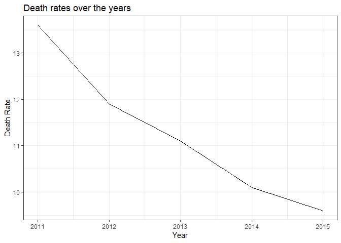
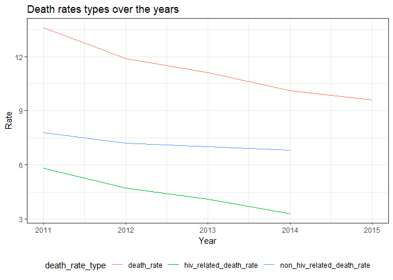
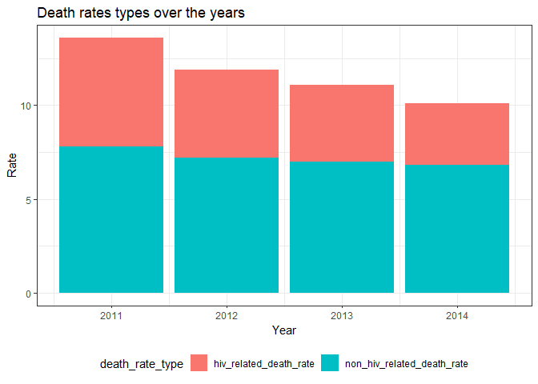
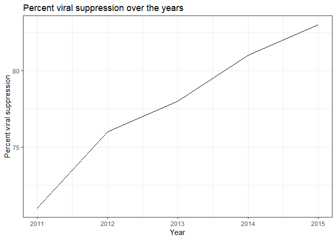
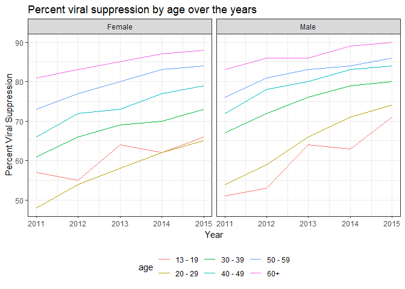
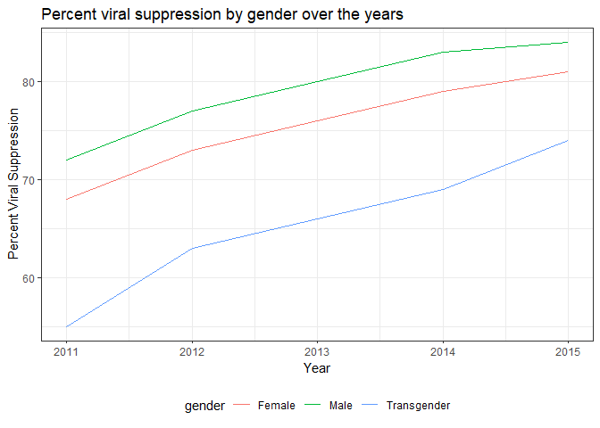
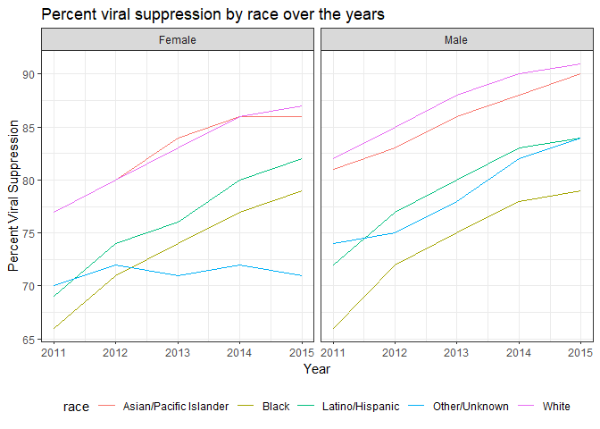

EDA - death rates
================
Bryce Wong
November 19, 2018

### Exploratory Data Analysis of death rate outcome variables for HIV/AIDS in NYC

Loading libraries:

``` r
library(tidyverse)
```

    ## -- Attaching packages ------------------------------------ tidyverse 1.2.1 --

    ## v ggplot2 3.0.0     v purrr   0.2.5
    ## v tibble  1.4.2     v dplyr   0.7.6
    ## v tidyr   0.8.1     v stringr 1.3.1
    ## v readr   1.1.1     v forcats 0.3.0

    ## -- Conflicts --------------------------------------- tidyverse_conflicts() --
    ## x dplyr::filter() masks stats::filter()
    ## x dplyr::lag()    masks stats::lag()

``` r
library(patchwork)

theme_set(theme_bw() + theme(legend.position = "bottom"))
```

Loading the data:

``` r
hiv_data = read_csv("./data/DOHMH_HIV_AIDS_Annual_Report.csv") %>% 
  janitor::clean_names()
```

    ## Parsed with column specification:
    ## cols(
    ##   Year = col_integer(),
    ##   Borough = col_character(),
    ##   UHF = col_character(),
    ##   Gender = col_character(),
    ##   Age = col_character(),
    ##   Race = col_character(),
    ##   `HIV diagnoses` = col_integer(),
    ##   `HIV diagnosis rate` = col_double(),
    ##   `Concurrent diagnoses` = col_integer(),
    ##   `% linked to care within 3 months` = col_integer(),
    ##   `AIDS diagnoses` = col_integer(),
    ##   `AIDS diagnosis rate` = col_double(),
    ##   `PLWDHI prevalence` = col_double(),
    ##   `% viral suppression` = col_integer(),
    ##   Deaths = col_integer(),
    ##   `Death rate` = col_double(),
    ##   `HIV-related death rate` = col_double(),
    ##   `Non-HIV-related death rate` = col_double()
    ## )

Cleaning the data to just look at times, controlling for gender, age, race, borough, and UHF:

``` r
hiv_year_data = hiv_data %>% 
  filter(
    borough == "All",
    uhf == "All",
    gender == "All",
    age == "All",
    race == "All"
  )
```

Looking at death rates across time:

``` r
ggplot(hiv_year_data, aes(x = year, y = death_rate)) +   
  geom_line() +
  labs(
    title = "Death rates over the years",
    x = "Year",
    y = "Death Rate"
  )
```



Mapping all outcome variables on the same graph.

First gathering several outcome variables of interest into one outcome variable:

``` r
all_death_rates = hiv_year_data %>% 
  gather(key = death_rate_type, value = death_rate_nums, death_rate:non_hiv_related_death_rate) %>% 
  filter(death_rate_nums != 99999)

ggplot(all_death_rates, aes(x = year, y = death_rate_nums, group = death_rate_type)) +   
  geom_line(aes(color = death_rate_type)) +
  labs(
    title = "Death rates types over the years",
    x = "Year",
    y = "Rate"
  )
```



Making a stacked bar graph instead of a spaghetti plot - this is probably more informative than the spaghetti plot.

``` r
stacked_death_plot = all_death_rates %>% 
  filter(death_rate_type != "death_rate")

ggplot(stacked_death_plot, aes(x = year, y = death_rate_nums, group = death_rate_type)) +   
  geom_col(aes(fill = death_rate_type)) +
  labs(
    title = "Death rates types over the years",
    x = "Year",
    y = "Rate"
  )
```



### Percent viral suppression EDA (over time)

``` r
ggplot(hiv_year_data, aes(x = year, y = percent_viral_suppression)) +   
  geom_line() +
  labs(
    title = "Percent viral suppression over the years",
    x = "Year",
    y = "Percent viral suppression"
  )
```



Split by age and gender:

``` r
split_by_age = hiv_data %>% 
  filter(
    age != "All",
    borough == "All",
    uhf == "All"
    ) 

ggplot(split_by_age, aes(x = year, y = percent_viral_suppression, group = age)) +   
  geom_line(aes(color = age)) +
  facet_grid(~gender) +
  labs(
    title = "Percent viral suppression by age over the years",
    x = "Year",
    y = "Percent Viral Suppression"
  )
```



Percent viral suppression by gender over the years:

``` r
split_by_gender = hiv_data %>% 
  filter(
    age == "All",
    borough == "All",
    uhf == "All",
    race == "All",
    gender != "All"
    ) 

ggplot(split_by_gender, aes(x = year, y = percent_viral_suppression, group = gender)) +   
  geom_line(aes(color = gender)) +
  labs(
    title = "Percent viral suppression by gender over the years",
    x = "Year",
    y = "Percent Viral Suppression"
  )
```



Percent viral suppression by race over the years:

``` r
split_by_race = hiv_data %>% 
  filter(
    age == "All",
    borough == "All",
    uhf == "All",
    race != "All"
    ) 

ggplot(split_by_race, aes(x = year, y = percent_viral_suppression, group = race)) +   
  geom_line(aes(color = race)) +
  facet_grid(~gender) +
  labs(
    title = "Percent viral suppression by race over the years",
    x = "Year",
    y = "Percent Viral Suppression"
  )
```


